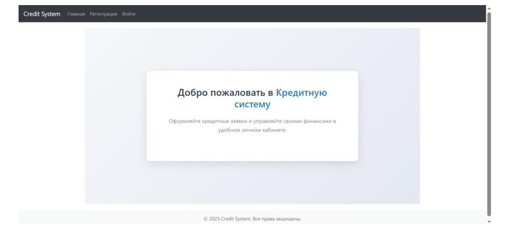
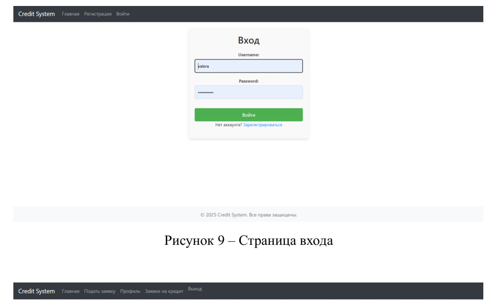
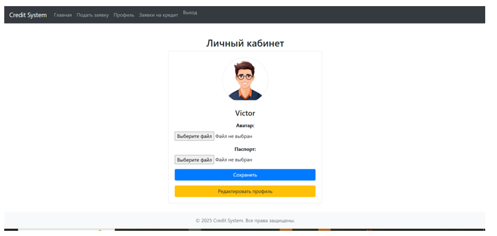
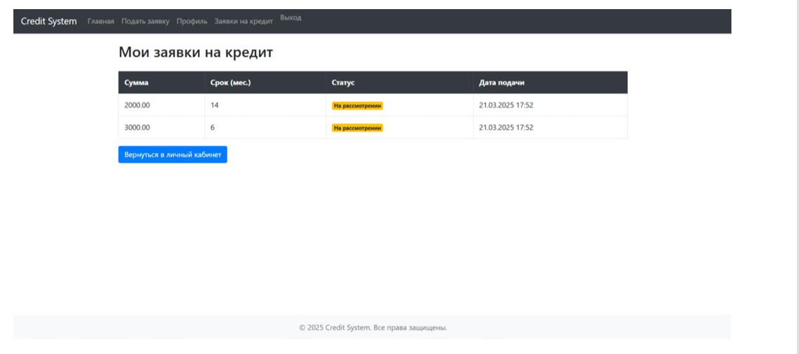
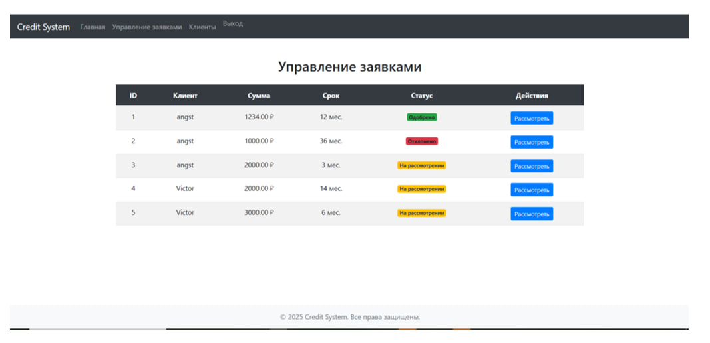

# 🏦 Система автоматизации кредитных заявок

## 📌 Описание проекта
Веб-приложение предназначено для автоматизации процесса подачи и одобрения
кредитных заявок в банковской организации.

Система позволяет клиентам оформлять кредитные заявки онлайн, а сотрудникам
банка — обрабатывать их, принимая решения об одобрении или отказе.

Приложение разработано с использованием **Django** и **PostgreSQL**.

---

## 🖥️ Интерфейс приложения

### 🏠 Главная страница


### 🔐 Страница входа


### 👤 Личный кабинет клиента


### 💳 Заявки клиента на кредит


### 🧑‍💼 Управление заявками (сотрудник банка)


---

## ⚙️ Основной функционал

### 👤 Пользователи
- Регистрация и аутентификация пользователей:
  - клиенты;
  - сотрудники банка;
  - администраторы.

### 💳 Кредитные заявки
- Подача кредитной заявки с указанием:
  - суммы кредита;
  - срока кредита.
- Просмотр статуса заявок клиентом.
- Рассмотрение заявок сотрудниками банка.
- Принятие решений:
  - одобрение;
  - отклонение.

### 📊 Управление кредитами
- Формирование и учет кредитов.
- Учет процентных ставок.
- Формирование графика платежей.

### 🏦 Банковские счета
- Учет банковских счетов клиентов.
- Отслеживание их статуса.

### 🔐 Безопасность и аудит
- Логирование всех действий пользователей.
- Контроль изменений заявок и решений.

---

## 🛠️ Используемые технологии
- **Backend:** Python, Django
- **Database:** PostgreSQL
- **Frontend:** HTML, CSS, JavaScript
- **Authentication:** Django Authentication System

---

## 🚀 Установка и запуск

```bash
git clone https://github.com/username/project-name.git
cd project-name
python -m venv venv
source venv/bin/activate  # Linux / macOS
venv\Scripts\activate     # Windows
pip install -r requirements.txt
python manage.py migrate
python manage.py runserver
